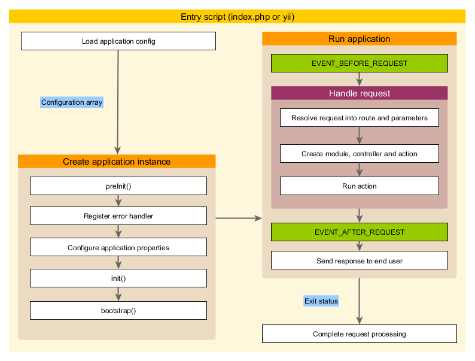

## 应用主体生命周期

当运行 入口脚本 处理请求时， 应用主体会经历以下生命周期:

    入口脚本加载应用主体配置数组。
    入口脚本创建一个应用主体实例：
        调用 preInit() 配置几个高级别应用主体属性， 比如 basePath。
        注册 error handler 错误处理方法。
        配置应用主体属性。
        调用 init() 初始化，该函数会调用 bootstrap() 运行引导启动组件。
    入口脚本调用 yii\base\Application::run() 运行应用主体:
        触发 EVENT_BEFORE_REQUEST 事件。
        处理请求：解析请求 路由 和相关参数； 创建路由指定的模块、控制器和动作对应的类，并运行动作。
        触发 EVENT_AFTER_REQUEST 事件。
        发送响应到终端用户。
    入口脚本接收应用主体传来的退出状态并完成请求的处理。
